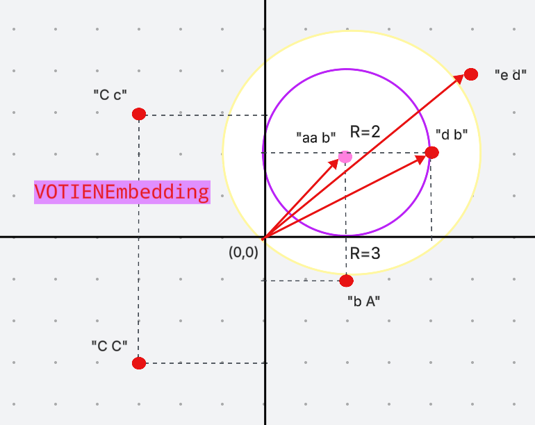

# Task 2 Hiện thực danh sách liên kết đơn

## Lệnh chạy

- Biên dịch :
```sh
g++ -std=c++17 -o main -I. -Isrc main.cpp tests/*.cpp src/VectorStore.cpp -DTESTING
```

- Chạy toàn bộ test
```sh
./main
```

- Chạy 1 test cụ thể  `TEST_CASE("VectorStore basic operations")`
```sh
./main --test-case="VectorStore basic operations"
```


- Check memory
```sh
g++ -std=c++17 -fsanitize=address -fno-omit-frame-pointer -g -O0 -Wall -Wextra -I. -Isrc main.cpp tests/*.cpp src/VectorStore.cpp -DTESTING -o main_memory

./main_memory 
```


- Debug đã cấu hình làm giống task trước là được


## VectorStore

###  Giới thiệu
`VectorStore` là một lớp (class) quản lý tập hợp các vector (embedding) để phục vụ các bài toán tìm kiếm lân cận gần nhất (Nearest Neighbor Search).  
Vector có thể biểu diễn đặc trưng của văn bản, hình ảnh, âm thanh hoặc dữ liệu khác dưới dạng mảng số thực.

Mục tiêu của `VectorStore`:
- Lưu trữ nhiều vector trong bộ nhớ.
- Hỗ trợ thêm vector mới.
- Tìm vector gần nhất hoặc top-k vector gần nhất với vector truy vấn.
- Cho phép lựa chọn độ đo (metric) khác nhau: **Cosine similarity**, **Euclidean distance**, ...


---

## Quy trình
1. **Dữ liệu thô**: văn bản, hình ảnh, âm thanh...  
2. **Embedding**: chuyển dữ liệu thô thành vector số học.  
3. **Lưu trữ & tìm kiếm**: lưu các vector trong `VectorStore`, truy vấn sẽ được so sánh bằng độ đo (cosine, Euclidean...).

---

## Ứng dụng
- **Semantic Search**: tìm kiếm ngữ nghĩa thay vì so khớp từ khóa.
- **Chatbot có trí nhớ**: lưu embeddings hội thoại để tham chiếu ngữ cảnh.
- **Recommendation Systems**: gợi ý sản phẩm gần giống.
- **Multimedia Retrieval**: tìm ảnh, video, audio tương tự.

---

## BTL

### Hàm Embedding

**1. `TestHelper::VOTIENEmbedding`**

- Chuyển chuỗi thành vector bằng cách cộng vị trí chữ cái trong từng từ.  
- Quy ước:  
  - `'a' = 1, 'b' = 2, ..., 'z' = 26`  
  - `'A' = -1, 'B' = -2, ..., 'Z' = -26`  

Ví dụ:
```c++
Input : "aA BC EE"
Output: [0, -5, -10]
```

**2. `TestHelper::countCharsPerWord`**

- Đếm số ký tự chữ cái trong từng từ.  
- Ký tự không phải chữ (ví dụ `!`, `1`, `@`) bị bỏ qua.  

Ví dụ:
```c++
Input : "aA BC xyz"
Output: [2, 2, 3]
```

### Các loại so sánh

**1.Cosine similarity (độ tương đồng cosin)** là một độ đo để tính mức độ giống nhau giữa hai vector trong không gian nhiều chiều. Giá trị nằm trong khoảng từ `[-1,1]`:

- 1 → hai vector cùng hướng (giống hệt).
- 0 → hai vector vuông góc (không liên quan).
- -1 → hai vector ngược hướng (trái ngược hoàn toàn).

**Công thức:**
```
cosine_similarity(A, B) = (A · B) / (|A| * |B|)

Trong đó:
- A · B = a1*b1 + a2*b2 + ... + an*bn  (tích vô hướng)  
- |A| = sqrt(a1^2 + a2^2 + ... + an^2)  (độ dài vector A)  
- |B| = sqrt(b1^2 + b2^2 + ... + bn^2)  (độ dài vector B)  
```


**2.Manhattan distance (khoảng cách Manhattan / L1-norm)** Đo độ khác biệt bằng tổng giá trị tuyệt đối giữa các thành phần.

**Công thức:**
```
manhattan_distance(A, B) = |a1 - b1| + |a2 - b2| + ... + |an - bn|
```


**3.Euclidean distance (khoảng cách Euclid / L2-norm)** Đo khoảng cách đường thẳng ngắn nhất giữa hai vector. Đây là độ đo phổ biến nhất.

**Công thức:**
```
euclidean_distance(A, B) = sqrt((a1 - b1)^2 + (a2 - b2)^2 + ... + (an - bn)^2)
```

### Function findNearest

1. **Duyệt toàn bộ dữ liệu đã lưu trong VectorStore**  
   - VectorStore giống như một kho chứa nhiều vector (embedding).  
   - Hàm lấy lần lượt từng vector trong kho để so sánh với vector truy vấn.  

2. **Tính độ đo similarity/distance**  
   - Dựa trên tham số `metric`:  
     - **Cosine** → tính góc giữa hai vector.  
     - **Euclidean** → tính khoảng cách đường thẳng (giống thước kẻ).  
     - **Manhattan** → tính khoảng cách đi theo “lưới ô vuông” (giống đi bộ theo phố).  

3. **So sánh và cập nhật giá trị tốt nhất**  
   - Nếu dùng **Cosine**: chọn vector có similarity **cao nhất**.  
   - Nếu dùng **Euclidean/Manhattan**: chọn vector có distance **nhỏ nhất**.  
   - Trong quá trình duyệt, luôn giữ lại kết quả tốt nhất hiện tại.  

4. **Trả về kết quả**  
   - Sau khi duyệt hết VectorStore, kết quả cuối cùng là vector **gần nhất** với truy vấn.  
   - Hàm có thể trả về chỉ số (index), ID, hoặc chính vector đó.  



### Function topKNearest gợi ý dùng mergesort/quicksort độ phức tạp `nlog(n)`, nếu bằng khoảng cách thì ưu tiên index nhở hơn đảm bảo tính stable
